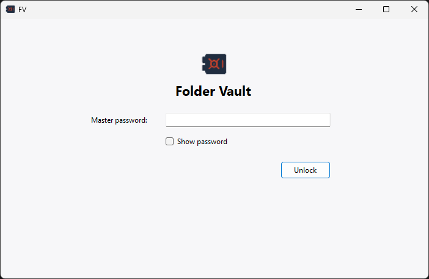
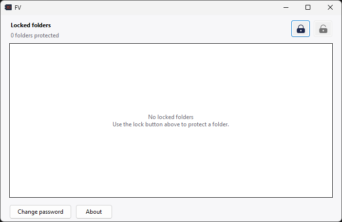

# FV

Lightweight folder access control for Windows.

- **Version:** See [version.txt](version.txt)
- **Author:** Imamul Kadir
- **Company:** PentaPet
- **Website:** [imamulkadir.github.io](https://imamulkadir.github.io/)

FV is a native Windows Forms application built against the .NET Framework. It
does not package Python, PySide6, Qt, cryptography, or PowerShell, keeping the
compiled application at approximately 100 KB.

## Interface

### Unlock window



### Main window



## Features

- Direct Windows ACL locking and restoration with no terminal window.
- Explorer **Unlock with FV** context-menu command.
- Changeable master password with password visibility controls.
- Automatic interface relock after 30 seconds without activity.
- Lightweight native Windows interface.
- Files are never moved, renamed, deleted, hidden, or encrypted.

## Build

Requirements:

- Windows with .NET Framework 4.8
- Python 3 to run the build helper

From the project directory, run:

```powershell
python .\build_exe.py
```

The compiled application is written to:

```text
dist\FV.exe
```

The build uses `FV.cs`, `fv.ico`, and the SVG files in `assets`.

## Versioning

Update the single value in version.txt using major.minor.patch format. For
example:

    2.5.0

Then rebuild:

    python .\build_exe.py

The build validates the value and applies it to the About window and Windows
executable version properties automatically.

## Compatibility

Existing locked-folder recovery records are preserved. On the first launch of
version 2.4, FV asks you to create a new master password because the former
password verifier depended on the removed Python cryptography package.
